# Hello! 👋

**Welcome to my README! 😊**
I created this with curiosity, a passion for learning, and a storyteller's mindset.

# Machine Learning with Python — From Fundamentals to Real-World AI


<p align="center">


<br>


<br>


</p>

<h1 align="center">Machine Learning with Python</h1>

<p align="center">
  <b>A practical journey from Machine Learning fundamentals to Deep Learning, NLP, Recommendation Systems and real-world projects.</b>
</p>

<p align="center">
  <i>Learn → Experiment → Visualize → Evaluate → Build → Improve</i>
</p>

---

# 1. About This Repository

This repository documents my hands-on journey through **Machine Learning, Data Science and AI** using Python.

It contains practical notebooks, experiments, visualizations, model evaluations and project-based implementations covering the complete ML workflow.

The goal is not only to understand algorithms theoretically, but to understand:

- How data is prepared
- How features are engineered
- How models are trained
- How different algorithms behave
- How models are evaluated
- How hyperparameters are optimized
- How ML pipelines are designed
- How machine learning is applied to real-world problems

---

# 2.Machine Learning Journey

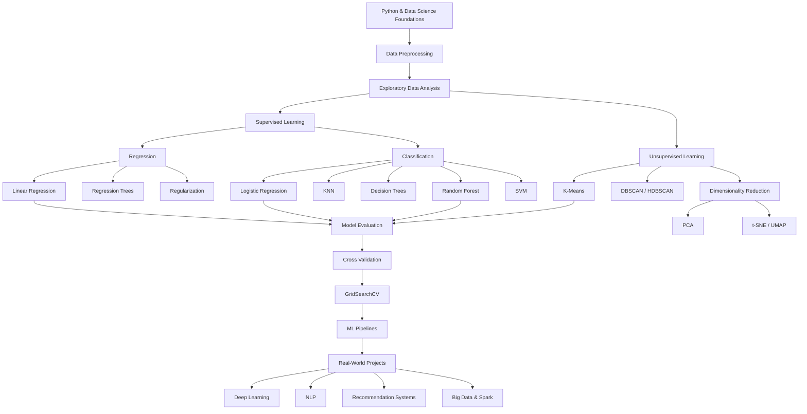

---

# 3. Table of Contents

* [About This Repository](#-about-this-repository)
* [Machine Learning Journey](#-machine-learning-journey)
* [Technology Stack](#-technology-stack)
* [Machine Learning Coverage](#-machine-learning-coverage)
* [Data Science & Visualization](#-data-science--visualization)
* [Supervised Learning](#-supervised-learning)
* [Unsupervised Learning](#-unsupervised-learning)
* [Model Evaluation & Optimization](#-model-evaluation--optimization)
* [Recommendation Systems](#-recommendation-systems)
* [Natural Language Processing](#-natural-language-processing)
* [Big Data & Apache Spark](#-big-data--apache-spark)
* [Deep Learning](#-deep-learning)
* [Complete Visualization Gallery](#-complete-visualization-gallery)
* [Hands-On Projects](#-hands-on-projects)
* [Repository Structure](#-repository-structure)
* [Skills Demonstrated](#-skills-demonstrated)
* [Learning Progression](#-learning-progression)
* [Future Roadmap](#-future-roadmap)
* [About Me](#-about-me)
* [Journey Continues](#-journey-continues)

---

# 4. Technology Stack

##  Programming & Data

<p align="center">


</p>

### Core Libraries

| Category          | Technologies                |
| ----------------- | --------------------------- |
| Programming       | Python                      |
| Data Manipulation | NumPy, Pandas               |
| Visualization     | Matplotlib, Seaborn, Plotly |
| Machine Learning  | Scikit-learn                |
| Gradient Boosting | XGBoost                     |
| Deep Learning     | TensorFlow, Keras           |
| NLP               | NLTK                        |
| Big Data          | Apache Spark                |
| Development       | Jupyter Notebook, VS Code   |
| Version Control   | Git, GitHub                 |

---

# 5.Machine Learning Coverage

This repository covers the complete machine learning workflow.

| Area                     | Concepts                                      |
| ------------------------ | --------------------------------------------- |
| Data Preprocessing       | Cleaning, transformation, feature preparation |
| Regression               | Simple & Multiple Linear Regression           |
| Classification           | Binary & Multi-class Classification           |
| Decision Trees           | Classification & Regression Trees             |
| Random Forest            | Ensemble Learning                             |
| SVM                      | Support Vector Machines                       |
| KNN                      | K-Nearest Neighbors                           |
| Clustering               | K-Means, DBSCAN, HDBSCAN                      |
| Dimensionality Reduction | PCA, t-SNE, UMAP                              |
| Evaluation               | Accuracy, Precision, Recall, F1, ROC-AUC      |
| Validation               | Train/Test Split, Cross Validation            |
| Optimization             | GridSearchCV, Hyperparameter Tuning           |
| Pipelines                | Scikit-learn ML Pipelines                     |
| NLP                      | Text Processing & Classification              |
| Recommendation           | Recommender System Concepts                   |
| Deep Learning            | ANN, TensorFlow, Keras                        |
| Big Data                 | Apache Spark                                  |

---

# 6. Data Science & Visualization

A strong ML workflow starts with understanding the data.

I practiced exploratory data analysis and visualization using:

* Pandas
* Matplotlib
* Seaborn
* Plotly
* Statistical analysis
* Correlation analysis
* Distribution analysis
* Categorical analysis
* Time-series visualization
* Heatmaps
* Boxplots
* Scatterplots
* Histograms
* Bar charts


**Choose:**  **EDA dashboard / correlation heatmap / multi-plot visualization**.


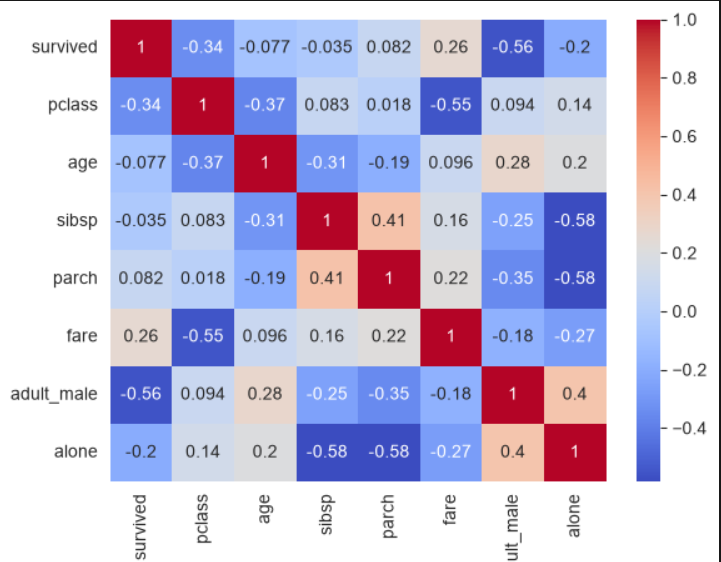


---

# 6a. Supervised Learning

Supervised learning forms one of the core parts of this repository.

---

## 6b.Regression

### Concepts Covered

* Simple Linear Regression
* Multiple Linear Regression
* Regression Trees
* Regularization
* Model prediction
* Regression metrics

### Algorithms

```text
Linear Regression
      ↓
Multiple Linear Regression
      ↓
Regression Trees
      ↓
Regularization
```


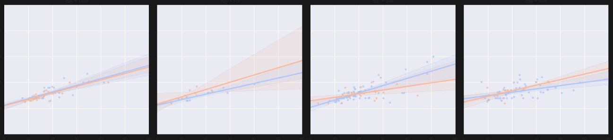


---

## 6c. Simple Linear Regression

Simple Linear Regression models the relationship between an independent variable and a continuous target variable.

### Workflow

```text
Dataset
   ↓
Feature Selection
   ↓
Train/Test Split
   ↓
Model Training
   ↓
Prediction
   ↓
Evaluation
```


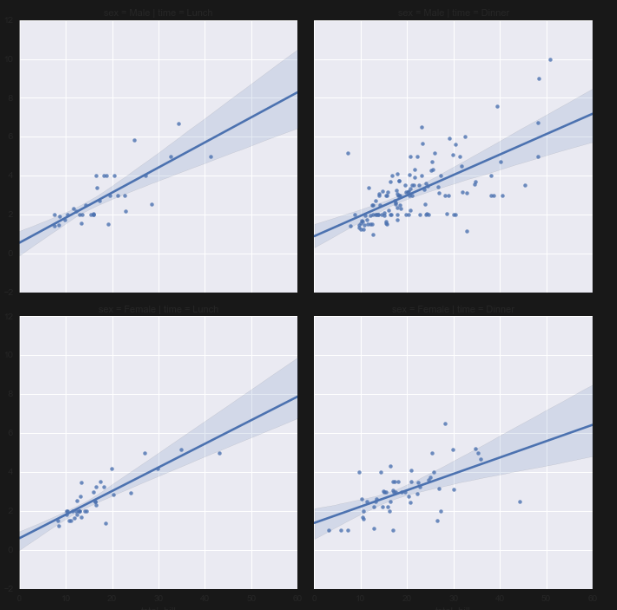


---

## 6d. Multiple Linear Regression

Multiple Linear Regression extends regression to multiple independent variables.

### Key Skills

* Feature selection
* Multiple predictors
* Model fitting
* Prediction
* Evaluation
* Interpretation


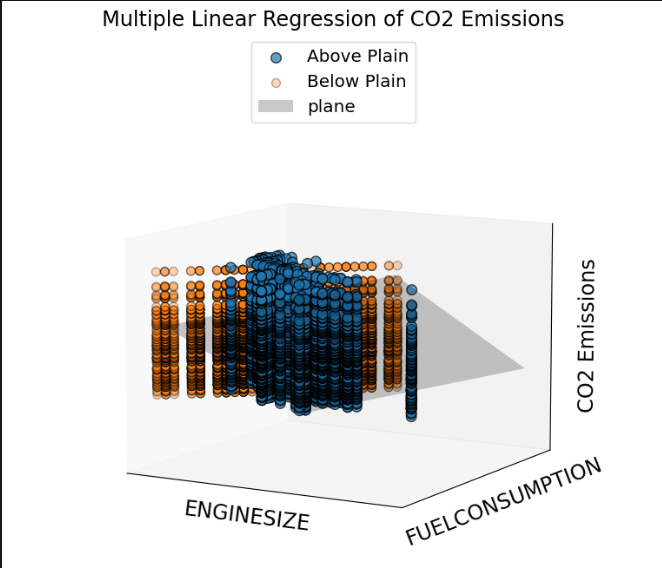


---

## 6e. Regularization

Regularization helps control model complexity and reduce overfitting.

### Concepts

* Ridge Regression
* Lasso Regression
* Model complexity
* Bias-variance trade-off
* Overfitting control

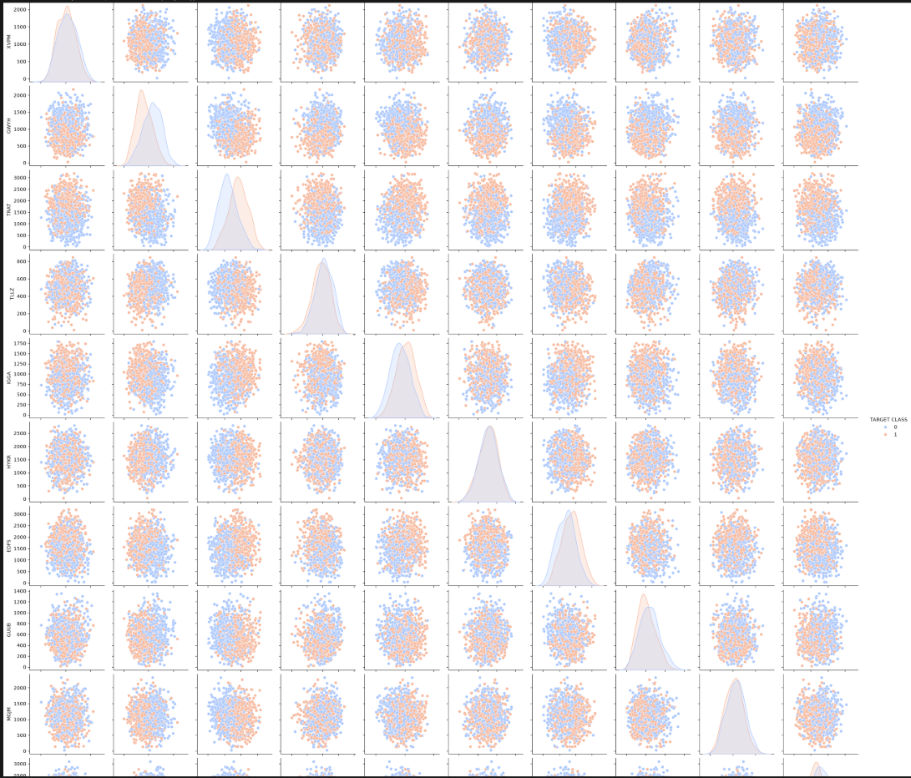


---

# 6f. Classification

Classification is used to predict categorical outcomes.

### Topics Covered

* Logistic Regression
* Binary Classification
* Multi-class Classification
* KNN Classification
* Decision Trees
* Random Forest
* SVM

---

## 6g. Logistic Regression

Logistic Regression is used for classification problems where the target represents discrete classes.

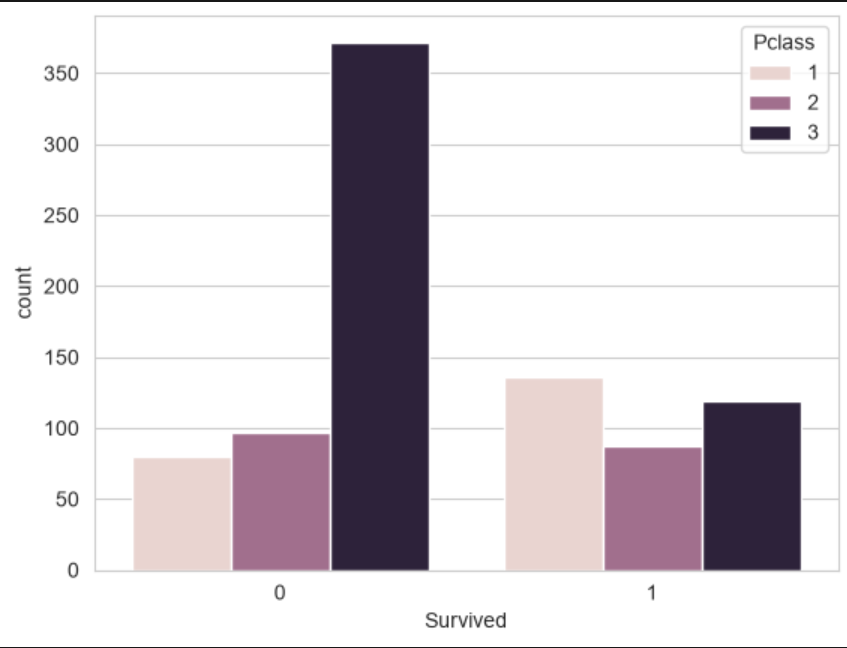


---

## 6h. Decision Trees

Decision Trees make predictions using a sequence of decision rules.

### Concepts

* Splitting
* Gini impurity
* Entropy
* Information gain
* Tree depth
* Overfitting


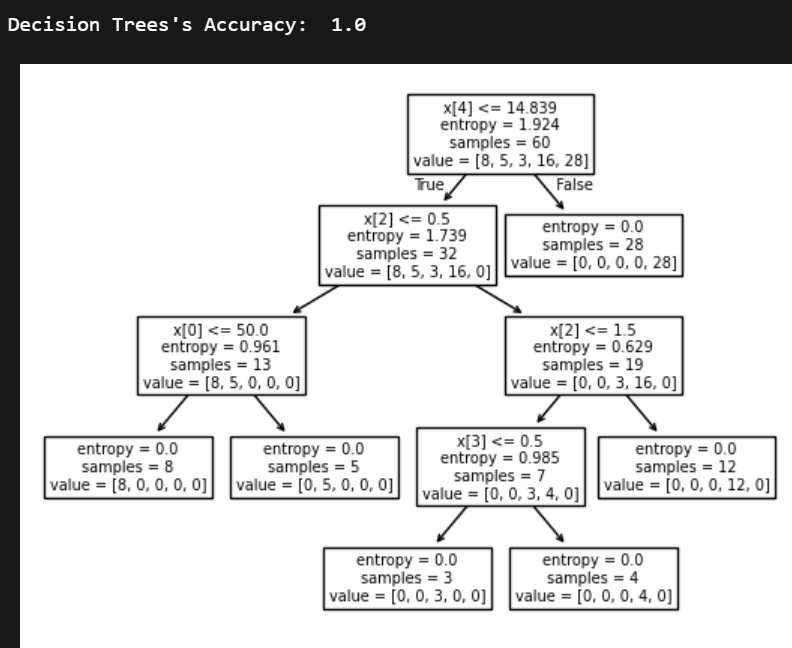

---

## 6i. Random Forest

Random Forest combines multiple decision trees to create a powerful ensemble model.

### Concepts

* Ensemble learning
* Bagging
* Multiple decision trees
* Feature importance
* Classification
* Regression

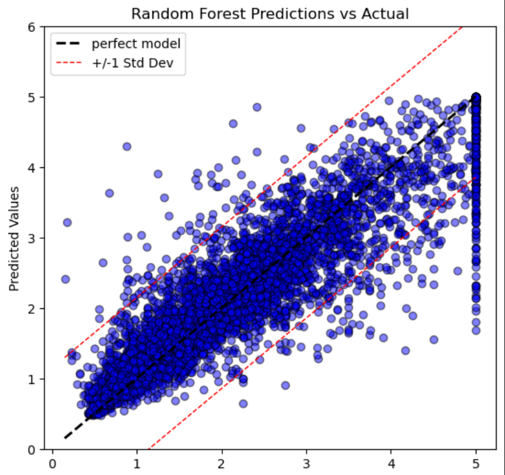


---

## 6j. K-Nearest Neighbors — KNN

KNN predicts a class based on neighboring observations.

### Concepts

* Distance metrics
* Nearest neighbors
* Classification
* Choosing K
* Model evaluation

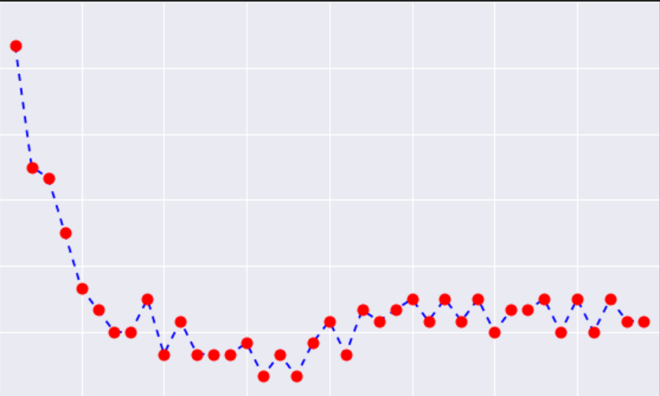


---

## 6k. Support Vector Machines — SVM

SVM finds an optimal decision boundary between classes.

### Concepts

* Hyperplanes
* Margins
* Support vectors
* Classification
* Kernel concepts

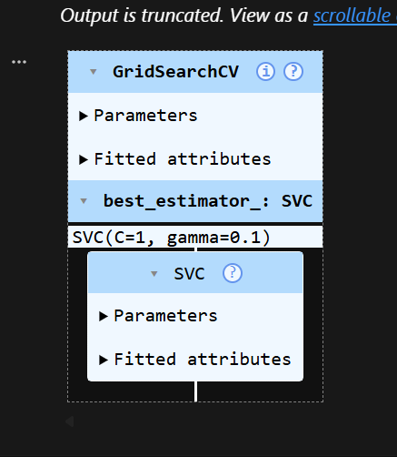


---

# 6l. Unsupervised Learning

Unsupervised learning discovers hidden patterns and structures in unlabeled data.

---

# 6m. K-Means Clustering

K-Means groups observations into clusters based on similarity.

### Concepts

* Cluster formation
* Centroids
* Distance calculation
* Customer segmentation
* Elbow method
* Cluster evaluation

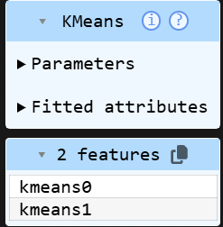


## 6n. PCA — Principal Component Analysis

PCA transforms high-dimensional data into a smaller set of principal components.

### Concepts

* Principal components
* Variance
* Feature transformation
* Dimensionality reduction


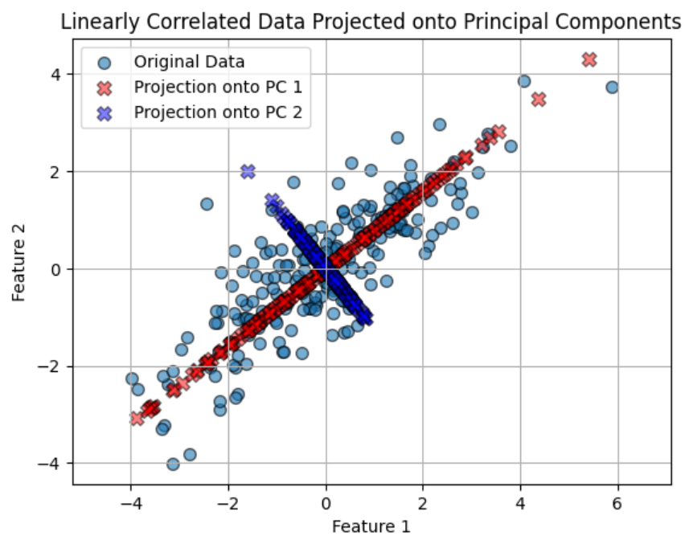


---

## 6o.t-SNE & UMAP

t-SNE and UMAP are powerful techniques for visualizing high-dimensional datasets.

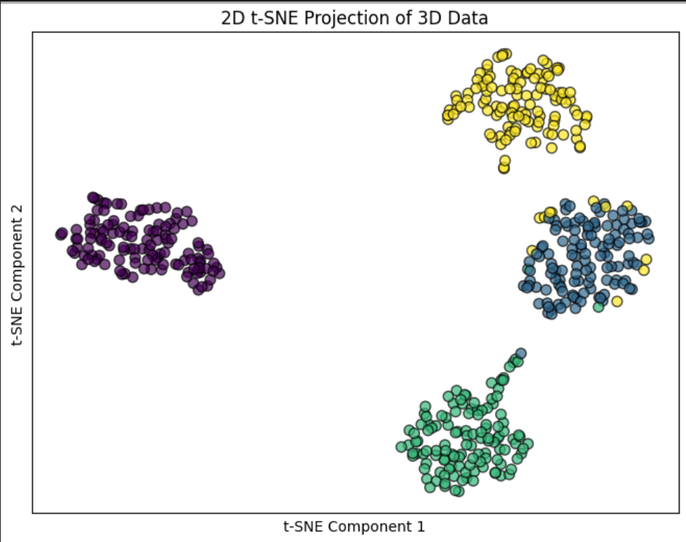


---

# 6p. Model Evaluation & Optimization

Building a model is only one part of Machine Learning.

A production-oriented workflow requires reliable evaluation and optimization.

### Evaluation Techniques

* Accuracy
* Precision
* Recall
* F1 Score
* Confusion Matrix
* ROC-AUC
* Cross Validation
* Model comparison

### Optimization

* Hyperparameter tuning
* GridSearchCV
* Cross-validation
* Pipeline construction

---

## 6q. Classification Model Evaluation

### ⭐ Best Visualization

Choose your **confusion matrix heatmap**.


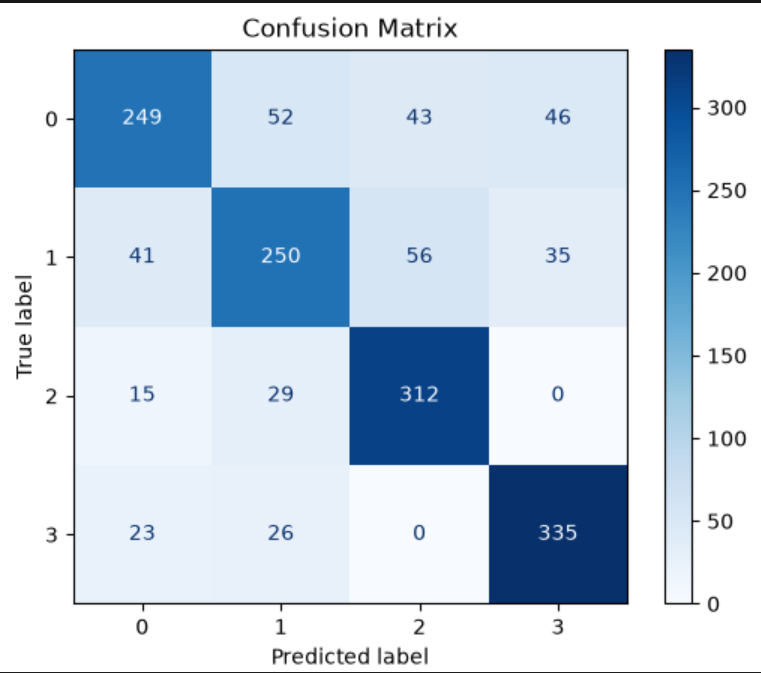


## 6r.Cross Validation

Cross-validation provides a more reliable estimate of model performance.

```text
Dataset
   ↓
Fold 1
Fold 2
Fold 3
Fold 4
Fold 5
   ↓
Average Performance
```

---

# 6s. ML Pipelines & GridSearchCV

A professional ML workflow should avoid disconnected preprocessing and modeling steps.

This repository includes experiments with:

* Scikit-learn Pipelines
* StandardScaler
* PCA
* KNN
* GridSearchCV
* Hyperparameter optimization
* Cross-validation

### Pipeline

```text
Raw Data
   ↓
Preprocessing
   ↓
Scaling
   ↓
Dimensionality Reduction
   ↓
Model
   ↓
GridSearchCV
   ↓
Best Parameters
   ↓
Evaluation
```
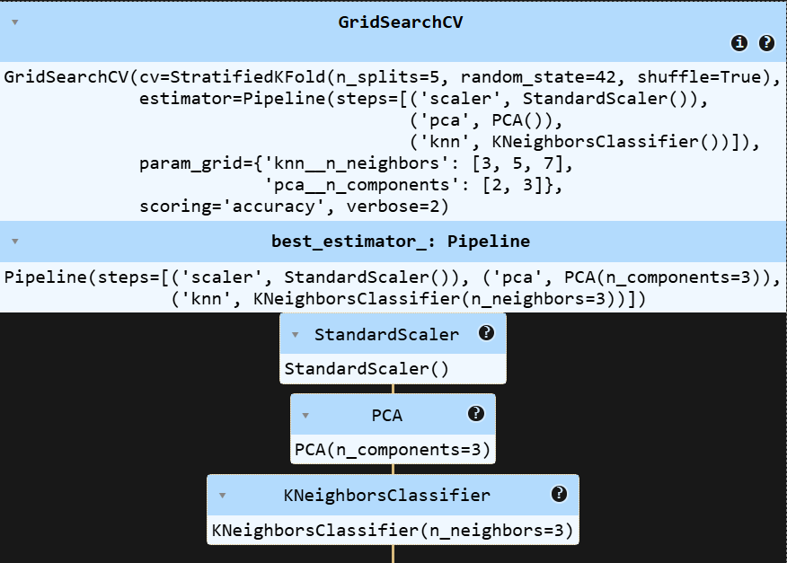


---

# 6t. Recommendation Systems

Recommendation systems are used to personalize content, products and services.

### Concepts Covered

* Recommender systems
* Similarity
* User-item relationships
* Recommendation workflows
* Recommendation project experiments

### Applications

* Netflix
* Amazon
* Spotify
* YouTube
* E-commerce
* Travel platforms

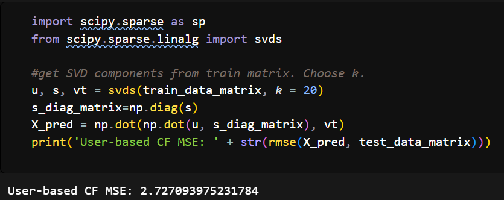


---

# 6u. Natural Language Processing

NLP enables machines to process and understand human language.

### Topics Covered

* Text preprocessing
* Tokenization
* Stopword removal
* Stemming
* Lemmatization
* Bag of Words
* Text classification
* NLTK
* NLP projects

### NLP Workflow

```text
Raw Text
   ↓
Cleaning
   ↓
Tokenization
   ↓
Stopword Removal
   ↓
Feature Extraction
   ↓
Model
   ↓
Prediction
```
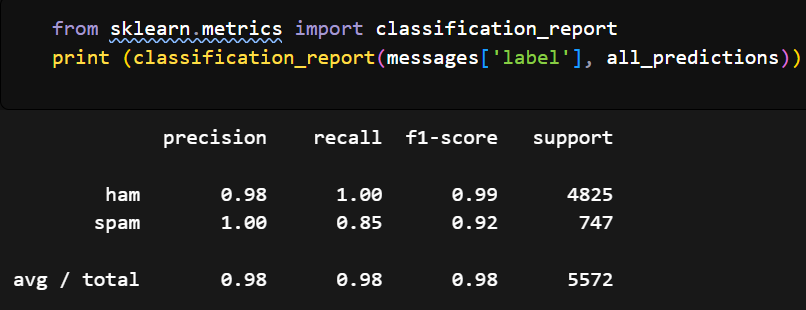


---

# 6v. Deep Learning

This repository also extends into Deep Learning using **TensorFlow and Keras**.

### Topics Covered

* Artificial Neural Networks
* TensorFlow
* Keras
* Neural network architecture
* Regression with neural networks
* Classification with neural networks
* MNIST
* Model training
* Model evaluation
* Training history
* TensorBoard

---

## 6w. Artificial Neural Networks

```text
Input Layer
     ↓
Hidden Layer
     ↓
Hidden Layer
     ↓
Output Layer
```
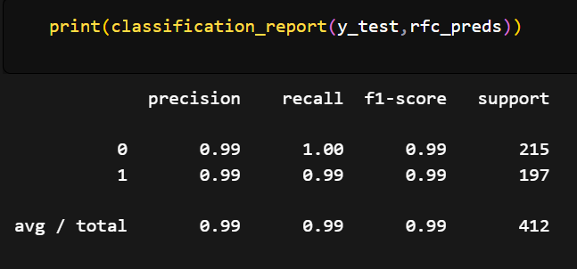


---

## 6x. Keras Regression - HeatmapKERAS

Keras was used to build neural-network-based regression workflows.

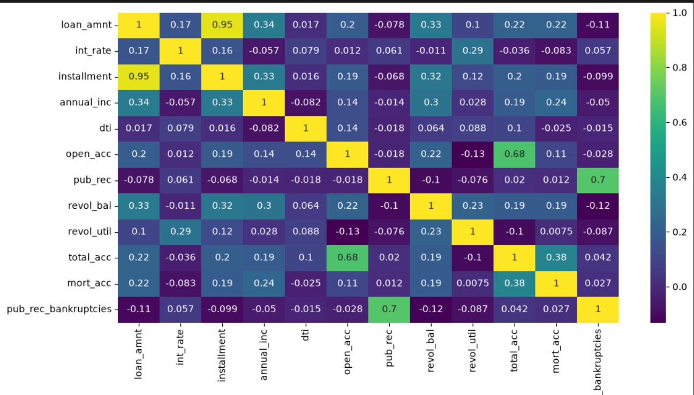


---

## 6y. Keras Classification

Neural networks were also explored for classification problems.

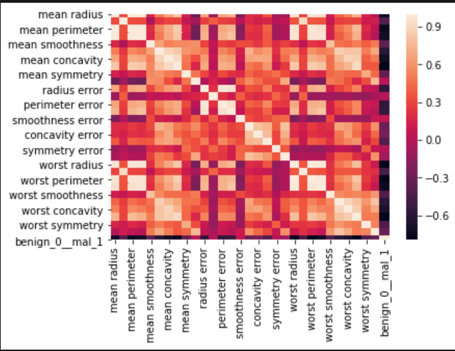


---

## 6z.Model loss

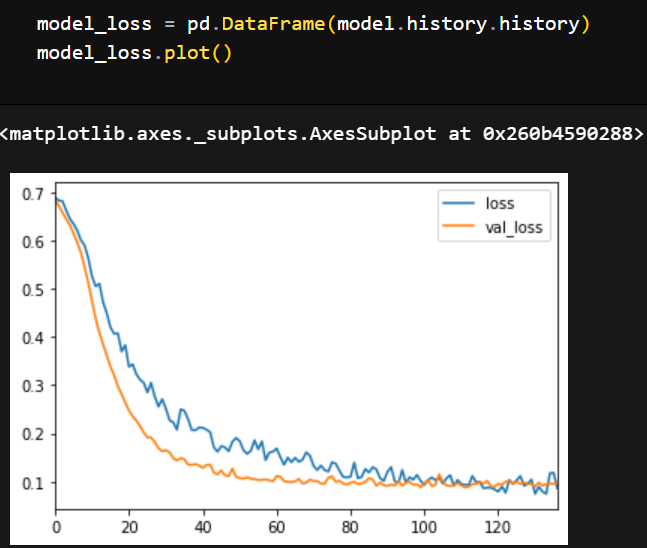
**epochs--600**
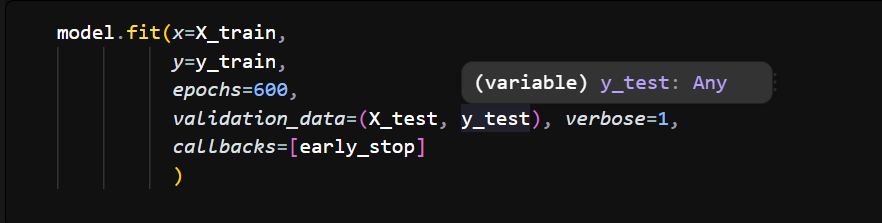


---


# 7. Hands-On Projects

---

## a. Australia Weather / Rainfall Prediction

A complete classification workflow using weather data.

### Workflow

```text
Weather Dataset
      ↓
Data Cleaning
      ↓
Feature Engineering
      ↓
Date Processing
      ↓
Season Extraction
      ↓
Model Training
      ↓
Random Forest
      ↓
Evaluation
```

### Key Concepts

* Data preprocessing
* Feature engineering
* Date feature extraction
* Seasonal analysis
* Classification
* Random Forest
* Model evaluation


---

## b.Taxi Tip / Regression Trees

A regression workflow based on taxi data.

### Concepts

* Regression Trees
* Feature preparation
* Model training
* Prediction
* Regression metrics

---

## c.Credit Card Fraud Detection

Classification experiments using tree-based and SVM approaches.

### Concepts

* Classification
* Decision Trees
* SVM
* Fraud detection
* Model evaluation


---

## d.Customer Segmentation

K-Means clustering applied to customer segmentation.

### Concepts

* Unsupervised Learning
* K-Means
* Clustering
* Customer segmentation
* Visualization


---

## e. 911 Calls Analysis

Exploratory data analysis of emergency call data.

### Concepts

* EDA
* Time-based analysis
* Data visualization
* Pattern analysis


---

## f. Finance Data Analysis

Finance-oriented exploratory analysis and visualization.


# 8.  Project Portfolio

| Project                      | Domain              | Techniques                    |
| ---------------------------- | ------------------- | ----------------------------- |
| Australia Weather Prediction | Machine Learning    | Classification, Random Forest |
| Customer Segmentation        | Unsupervised ML     | K-Means                       |
| Credit Card Fraud Detection  | ML                  | Decision Tree, SVM            |
| Taxi Tip Prediction          | Regression          | Regression Trees              |
| 911 Calls Analysis           | Data Science        | EDA, Visualization            |
| Finance Data Analysis        | Data Science        | EDA, Visualization            |
| NLP Projects                 | NLP                 | Text Processing, NLTK         |
| Recommendation System        | Recommender Systems | Similarity & Recommendations  |
| Deep Learning Projects       | Deep Learning       | TensorFlow, Keras             |
| MNIST Classification         | Computer Vision     | Neural Networks               |

---


# 9.Future Roadmap

The next stage of this journey focuses on building production-oriented AI and Data Science systems.

### Next Goals

* Advanced Machine Learning
* Feature Engineering
* Advanced NLP
* Transformers
* Large Language Models
* Generative AI
* MLOps
* Model Deployment
* FastAPI
* Docker
* Cloud Deployment
* AWS
* Production ML Pipelines
* Real-world end-to-end projects

---

# 10 About Me 😊😊

Hi! I'm **Divya Upadhyay😊**, a final-year **BTech Computer Science & Engineering student specializing in Artificial Intelligence**.

I am passionate about:

* Data Science
* Machine Learning
* Artificial Intelligence
* Deep Learning
* NLP
* Generative AI
* Problem Solving
* Building real-world projects

I enjoy transforming raw data into meaningful insights and building machine learning solutions that solve practical problems.

**Thank you for your valuable time and for exploring my work! 🤝**


