Bilkul — problem ye thi ki tumhare Markdown mein **`<p>`, ``, `#`, `*`, links etc. unnecessarily escape ho gaye the**, isliye GitHub par raw/ajeeb text dikh raha tha.

Neeche **ek hi complete Markdown code block** hai. Isko **exactly copy karke `README.md`** mein paste karna. Maine upper portion ko proper standard GitHub Markdown mein fix kiya hai, aur graphs/flowcharts ko bhi clean rakha hai. **Koi image file add nahi ki hai**; pipeline ke liye proper Mermaid diagram diya hai.

````markdown
# 🤖 Machine Learning with Python — From Fundamentals to Deep Learning

<p align="center">


</p>

<p align="center">
  <b>A structured, hands-on journey through Machine Learning, NLP, Recommendation Systems, Big Data and Deep Learning.</b>
</p>

<p align="center">
  <i>From data preprocessing and exploratory analysis to model building, evaluation, optimization, neural networks and end-to-end ML workflows.</i>
</p>

---

# 📌 About This Repository

This repository is my **hands-on Machine Learning laboratory**, documenting my practical journey from Python and Data Science foundations to Machine Learning, Advanced ML, NLP, Big Data and Deep Learning.

Rather than being only a collection of theoretical notes, this repository focuses on:

- Understanding Machine Learning concepts
- Working with real datasets
- Exploratory Data Analysis
- Data cleaning and preprocessing
- Feature engineering
- Visualization
- Regression
- Classification
- Clustering
- Dimensionality reduction
- Model evaluation
- Cross-validation
- Hyperparameter tuning
- Machine Learning pipelines
- Recommendation Systems
- Natural Language Processing
- Apache Spark
- Deep Learning
- TensorFlow
- Keras
- Artificial Neural Networks
- TensorBoard

### 🔄 Complete Learning Workflow

> **Problem → Data → EDA → Cleaning → Feature Engineering → Model → Evaluation → Optimization → Interpretation → Application**

---

# 🧠 Machine Learning Roadmap

```mermaid
flowchart TD

A[Raw Data] --> B[Data Understanding]
B --> C[EDA & Visualization]
C --> D[Data Cleaning]
D --> E[Feature Engineering]

E --> F{Machine Learning}

F --> G[Supervised Learning]
F --> H[Unsupervised Learning]

G --> I[Regression]
G --> J[Classification]

I --> I1[Linear Regression]
I --> I2[Regression Trees]

J --> J1[Logistic Regression]
J --> J2[KNN]
J --> J3[Decision Trees]
J --> J4[Random Forest]
J --> J5[SVM]
J --> J6[XGBoost]

H --> H1[K-Means]
H --> H2[DBSCAN / HDBSCAN]
H --> H3[PCA]
H --> H4[t-SNE / UMAP]

F --> K[Advanced ML]

K --> K1[Recommendation Systems]
K --> K2[NLP]
K --> K3[Apache Spark]
K --> K4[Deep Learning]

K4 --> K5[TensorFlow]
K4 --> K6[Keras]
K4 --> K7[ANN]
K4 --> K8[TensorBoard]

F --> L[Model Evaluation]
L --> M[Cross Validation]
M --> N[Hyperparameter Tuning]
N --> O[Model Selection]
O --> P[Deployment Ready Model]
````

---

# 📚 Table of Contents

* [About This Repository](#-about-this-repository)
* [Machine Learning Roadmap](#-machine-learning-roadmap)
* [Technology Stack](#-technology-stack)
* [Machine Learning Coverage](#-machine-learning-coverage)
* [Machine Learning Foundations](#-machine-learning-foundations)
* [Data Preprocessing](#-data-preprocessing)
* [Exploratory Data Analysis](#-exploratory-data-analysis)
* [Correlation Heatmap](#-correlation-heatmap)
* [Supervised Learning](#-supervised-learning)
* [Regression](#-regression)
* [Classification](#-classification)
* [Logistic Regression](#-1️⃣-logistic-regression)
* [K-Nearest Neighbors](#-2️⃣-k-nearest-neighbors)
* [Decision Trees](#-3️⃣-decision-trees)
* [Random Forest](#-4️⃣-random-forest)
* [Support Vector Machines](#-5️⃣-support-vector-machines)
* [XGBoost](#-6️⃣-xgboost)
* [Ensemble Learning](#-ensemble-learning)
* [Unsupervised Learning](#-unsupervised-learning)
* [K-Means Clustering](#-k-means-clustering)
* [DBSCAN](#-dbscan)
* [HDBSCAN](#-hdbscan)
* [Dimensionality Reduction](#-dimensionality-reduction)
* [t-SNE & UMAP](#-tsne--umap)
* [Model Evaluation](#-model-evaluation--optimization)
* [Cross Validation](#-cross-validation)
* [Hyperparameter Tuning](#-hyperparameter-tuning)
* [Machine Learning Pipelines](#-machine-learning-pipelines)
* [Recommendation Systems](#-recommendation-systems)
* [Natural Language Processing](#-natural-language-processing)
* [Big Data & Apache Spark](#-big-data--apache-spark)
* [Deep Learning](#-deep-learning)
* [TensorFlow & Keras](#-tensorflow--keras)
* [TensorBoard](#-tensorboard)
* [Data Visualization](#-data-visualization)
* [Hands-On Projects](#-hands-on-projects)
* [Complete ML Portfolio Map](#-complete-ml-portfolio-map)
* [End-to-End ML Workflow](#-end-to-end-ml-workflow)
* [Model Selection Framework](#-model-selection-framework)
* [Important Concepts Practiced](#-important-concepts-practiced)
* [Algorithms at a Glance](#-algorithms-at-a-glance)
* [Skills Demonstrated](#-skills-demonstrated)
* [Repository Structure](#-repository-structure)
* [Learning Progression](#-learning-progression)
* [Learning Philosophy](#-learning-philosophy)
* [Real-World Applications](#-real-world-applications)
* [Future Roadmap](#-future-roadmap)
* [Career Focus](#-career-focus)
* [About Me](#-about-me)
* [Current Technical Focus](#-current-technical-focus)
* [What I Want to Build](#-what-i-want-to-build)
* [Repository Highlights](#-repository-highlights)
* [The Bigger Picture](#-the-bigger-picture)
* [Final Perspective](#-final-perspective)
* [Journey Continues](#-journey-continues)

---

# 🛠️ Technology Stack

## 🐍 Programming

<p align="center">


</p>

## 📊 Data Science

<p align="center">


</p>

## 🤖 Machine Learning

<p align="center">


</p>

## 🧠 Deep Learning

<p align="center">


</p>

## 📝 Natural Language Processing

<p align="center">


</p>

## ⚡ Big Data

<p align="center">


</p>

## 💻 Development & Environment

<p align="center">


</p>

---

# 📊 Machine Learning Coverage

| Domain                   | Topics Covered                                | Hands-On |
| ------------------------ | --------------------------------------------- | :------: |
| Regression               | Linear Regression, Regression Trees           |     ✅    |
| Classification           | Logistic Regression, KNN, Decision Trees, SVM |     ✅    |
| Ensemble Learning        | Random Forest, XGBoost                        |     ✅    |
| Clustering               | K-Means, DBSCAN, HDBSCAN                      |     ✅    |
| Dimensionality Reduction | PCA, t-SNE, UMAP                              |     ✅    |
| Model Evaluation         | Classification & Regression Metrics           |     ✅    |
| Cross Validation         | K-Fold, StratifiedKFold                       |     ✅    |
| Optimization             | GridSearchCV, Hyperparameter Tuning           |     ✅    |
| ML Pipelines             | Pipeline, Scaling, PCA, Model Training        |     ✅    |
| Regularization           | Linear Regression Regularization              |     ✅    |
| Recommendation           | Recommender Systems                           |     ✅    |
| NLP                      | NLTK, Text Processing                         |     ✅    |
| Big Data                 | Apache Spark, RDDs                            |     ✅    |
| Deep Learning            | TensorFlow, Keras, ANN                        |     ✅    |
| Experiment Tracking      | TensorBoard                                   |     ✅    |

---

# 🧱 Machine Learning Foundations

This repository starts with the fundamental concepts required to understand how Machine Learning systems work.

### Core Concepts

* Machine Learning fundamentals
* Supervised Learning
* Unsupervised Learning
* Features and Target Variables
* Training Data
* Testing Data
* Validation Data
* Generalization
* Bias
* Variance
* Overfitting
* Underfitting
* Model Complexity
* Feature Engineering
* Data Preprocessing
* Model Selection

---

# 🧹 Data Preprocessing

Data preprocessing is one of the most important stages of every Machine Learning workflow.

### Covered

* Handling missing values
* Detecting duplicates
* Data type conversion
* Feature selection
* Feature transformation
* Categorical encoding
* Numerical feature scaling
* Standardization
* Normalization
* Train/Test Split
* Dataset preparation
* Preparing features for ML models

### Preprocessing Workflow

```text
Raw Dataset
     ↓
Data Inspection
     ↓
Missing Values
     ↓
Duplicates
     ↓
Data Cleaning
     ↓
Feature Transformation
     ↓
Encoding
     ↓
Scaling
     ↓
Train / Test Split
     ↓
Machine Learning Model
```

---

# 🔎 Exploratory Data Analysis

EDA is used to understand datasets before building Machine Learning models.

### EDA Includes

* Dataset inspection
* Descriptive statistics
* Distribution analysis
* Correlation analysis
* Outlier analysis
* Feature relationships
* Grouped analysis
* Pattern discovery
* Data visualization
* Feature understanding

### EDA Workflow

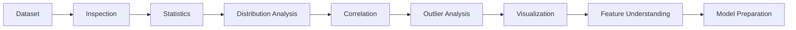

---

# 🔥 Correlation Heatmap

Correlation analysis helps identify relationships between numerical variables.

```python
import seaborn as sns
import matplotlib.pyplot as plt

plt.figure(figsize=(12, 8))

sns.heatmap(
    df.corr(numeric_only=True),
    annot=True,
    cmap="coolwarm",
    fmt=".2f"
)

plt.title("Feature Correlation Heatmap")
plt.show()
```

### Typical Workflow

```text
Dataset
   ↓
EDA
   ↓
Correlation Matrix
   ↓
Heatmap
   ↓
Feature Relationships
   ↓
Feature Selection
   ↓
Model Building
```

---

# 🎯 Supervised Learning

Supervised Learning is explored through both **Regression** and **Classification** problems.

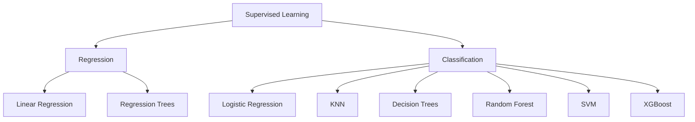

---

# 📈 Regression

Regression models are used when the target variable is continuous.

## Linear Regression

### Topics

* Simple Linear Regression
* Multiple Linear Regression
* Coefficients
* Intercept
* Predictions
* Residuals
* Regression assumptions
* Model evaluation
* Regularization concepts

### Metrics

```text
MAE
MSE
RMSE
R² Score
```

---

# 🌳 Regression Trees

Decision Tree Regression is explored for predicting continuous outcomes.

### Concepts

* Splitting
* Decision nodes
* Leaf nodes
* Tree depth
* Feature selection
* Prediction
* Regression evaluation

---

# 🏷️ Classification

Classification is used when the target variable belongs to one or more categories.

### Algorithms Covered

* Logistic Regression
* K-Nearest Neighbors
* Decision Trees
* Random Forest
* Support Vector Machines
* XGBoost

---

# 1️⃣ Logistic Regression

### Covered

* Binary Classification
* Multi-class Classification
* Probability Prediction
* Decision Boundaries
* Classification Metrics
* Model Evaluation

---

# 2️⃣ K-Nearest Neighbors

KNN predicts a sample based on nearby observations.

### Covered

* Distance calculation
* Choosing K
* Feature scaling
* Classification
* Model evaluation
* Model comparison

---

# 3️⃣ Decision Trees

Decision Trees learn a sequence of decision rules from data.

### Covered

* Root node
* Internal nodes
* Leaf nodes
* Entropy
* Gini impurity
* Information gain
* Tree depth
* Classification
* Regression

---

# 4️⃣ Random Forest

Random Forest combines multiple decision trees to improve model generalization.

### Covered

* Ensemble learning
* Bagging
* Random feature selection
* Feature importance
* Classification
* Regression
* Model comparison
* Evaluation

---

# 5️⃣ Support Vector Machines

SVM focuses on finding an optimal decision boundary with maximum margin.

### Covered

* Hyperplanes
* Support vectors
* Margins
* Kernel concepts
* Classification
* Feature scaling
* Model evaluation

---

# 6️⃣ XGBoost

XGBoost is explored as an advanced gradient boosting ensemble technique.

### Concepts

* Gradient boosting
* Sequential learners
* Weak learners
* Ensemble prediction
* Feature importance
* Hyperparameter optimization

---

# 🌲 Ensemble Learning

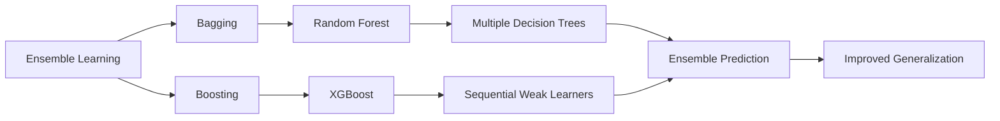

---

# 🔍 Unsupervised Learning

Unsupervised Learning focuses on discovering hidden patterns when labeled target variables are unavailable.

### Covered

* K-Means
* DBSCAN
* HDBSCAN
* PCA
* t-SNE
* UMAP

---

# 🟣 K-Means Clustering

### Concepts

* Centroids
* Distance
* Cluster assignment
* Iterative optimization
* Choosing K
* Cluster interpretation
* Customer segmentation
* Visualization

### K-Means Workflow

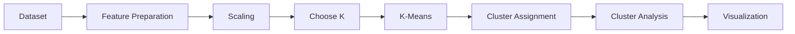

---

# 🔵 DBSCAN

DBSCAN is a density-based clustering algorithm capable of discovering clusters of different shapes.

### Concepts

* Core points
* Border points
* Noise
* Density
* Neighborhoods
* Outlier detection

---

# 🟢 HDBSCAN

HDBSCAN is explored as an advanced density-based clustering technique.

### Concepts

* Hierarchical density clustering
* Variable-density clusters
* Noise handling
* Cluster discovery

---

# 📐 Dimensionality Reduction

Dimensionality Reduction transforms high-dimensional data into fewer dimensions while attempting to preserve useful information.

---

## PCA — Principal Component Analysis

### Covered

* Principal components
* Variance
* Explained variance
* Feature transformation
* Dimensionality reduction
* Visualization
* PCA + Machine Learning pipelines

### PCA Workflow

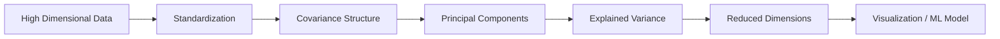

---

# 🌀 t-SNE & UMAP

t-SNE and UMAP are explored for visual analysis of high-dimensional data.

### Applications

* Cluster visualization
* Pattern discovery
* Feature-space exploration
* High-dimensional data analysis
* Visual representation of complex datasets

---

# 🧪 Model Evaluation & Optimization

A model is not useful simply because it trains successfully.

This repository focuses on **measuring, comparing and improving model performance**.

---

## 📊 Classification Metrics

```text
Accuracy
Precision
Recall
F1 Score
Confusion Matrix
Classification Report
ROC-AUC Concepts
```

---

## 📈 Regression Metrics

```text
MAE
MSE
RMSE
R² Score
```

---

## 🔍 Model Evaluation Workflow

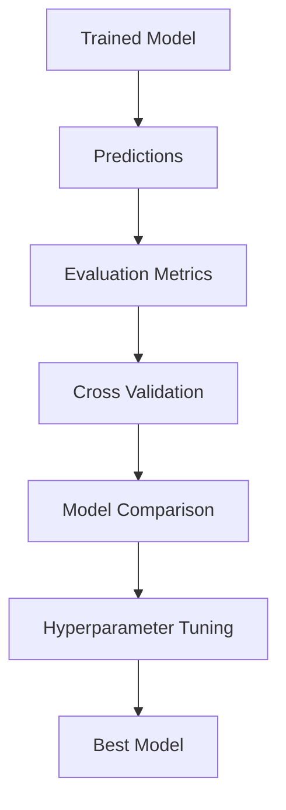

---

# 🔄 Cross Validation

Cross-validation provides a more reliable estimate of model performance.

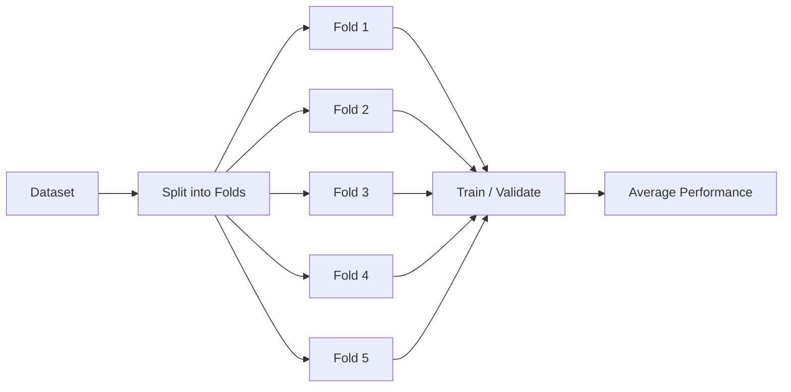

### Techniques

* K-Fold Cross Validation
* StratifiedKFold
* Model comparison
* Performance estimation

---

# 🎛️ Hyperparameter Tuning

The repository includes practical experimentation with:

```text
GridSearchCV
StratifiedKFold
Pipeline
PCA
KNN
Random Forest
```

### Example Search Space

```python
param_grid = {
    "knn__n_neighbors": [3, 5, 7],
    "pca__n_components": [2, 3]
}
```

---

# ⚙️ Machine Learning Pipelines

Machine Learning Pipelines connect preprocessing and modeling steps into a reproducible workflow.

## 🚀 ML Pipeline Architecture

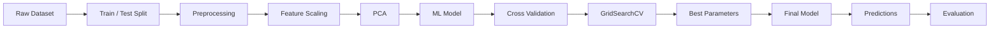

### Pipeline Benefits

* Reproducibility
* Cleaner workflows
* Reduced data leakage
* Consistent preprocessing
* Easier experimentation
* Hyperparameter optimization
* Better production readiness

### Example Pipeline Concept

```python
from sklearn.pipeline import Pipeline
from sklearn.preprocessing import StandardScaler
from sklearn.decomposition import PCA
from sklearn.neighbors import KNeighborsClassifier

pipeline = Pipeline([
    ("scaler", StandardScaler()),
    ("pca", PCA()),
    ("knn", KNeighborsClassifier())
])
```

---

# 🎯 Recommendation Systems

Recommendation Systems are explored as an important real-world Machine Learning application.

### Topics

* Recommendation System fundamentals
* Similarity-based recommendation
* User-item relationships
* Personalized recommendation concepts
* Recommendation workflows
* Ranking concepts

---

# 🛒 Recommendation System Architecture

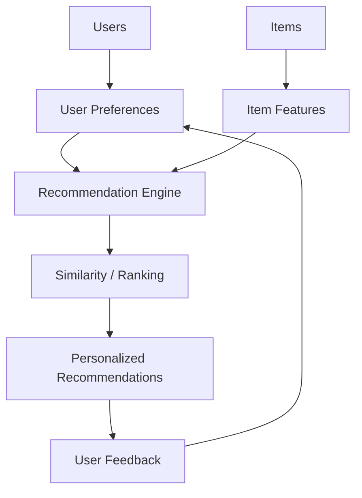

### Real-World Applications

* E-commerce
* Movies
* Music
* Social Media
* News
* Personalized Content

---

# 📝 Natural Language Processing

The repository includes hands-on NLP exploration using Python and NLTK.

## NLP Workflow

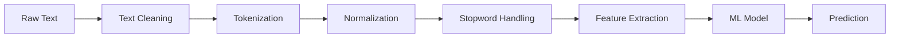

### Topics

* Natural Language Processing
* Tokenization
* Text Cleaning
* Stopword Processing
* Text Normalization
* Feature Preparation
* NLTK
* NLP Workflows

---

# 💬 NLP Applications

The concepts explored can be applied to:

* Sentiment Analysis
* Spam Detection
* Text Classification
* Customer Feedback Analysis
* Document Classification
* Search
* Recommendation
* Text Analytics

---

# ⚡ Big Data & Apache Spark

The repository also explores large-scale data processing concepts using Apache Spark.

### Covered

* Apache Spark fundamentals
* Spark with Python
* RDDs
* RDD Transformations
* RDD Actions
* Lambda Expressions
* Distributed Processing Concepts

---

# 🏗️ Spark Workflow

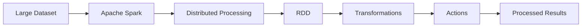

---

# 🤖 Deep Learning

The repository progresses from traditional Machine Learning into Neural Networks and Deep Learning.

### Covered

* Artificial Neural Networks
* TensorFlow
* Keras
* MNIST
* Neural Network Regression
* Neural Network Classification
* TensorFlow Estimators
* TensorBoard
* Deep Learning workflows

---

# 🧠 Neural Network Architecture

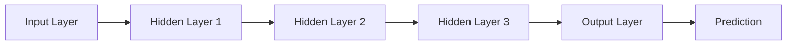

---

# 🔥 Artificial Neural Networks

### Core Concepts

* Neurons
* Layers
* Weights
* Biases
* Activation Functions
* Forward Propagation
* Loss Functions
* Optimization
* Backpropagation Concepts
* Training
* Validation
* Prediction

---

# 🧮 Deep Learning Workflow

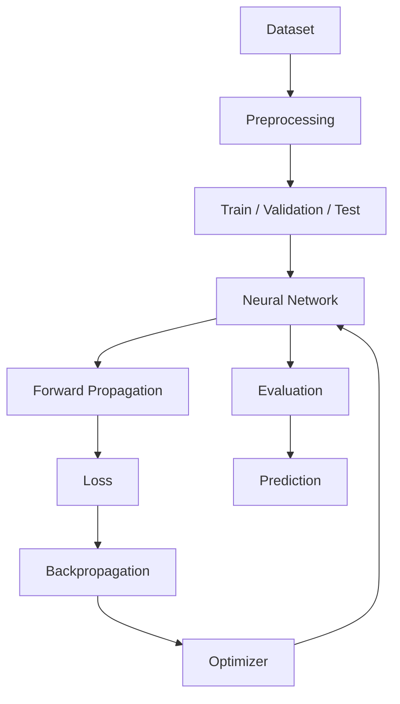

---

# 🧠 TensorFlow & Keras

## TensorFlow

Hands-on work includes:

* TensorFlow fundamentals
* Neural Networks
* TensorFlow Estimators
* MNIST
* Model Training
* Model Evaluation
* TensorBoard

## Keras

Hands-on work includes:

* Sequential Models
* Dense Layers
* Neural Network Regression
* Neural Network Classification
* Model Compilation
* Training
* Evaluation

---

# 📊 TensorBoard

TensorBoard is explored for monitoring and visualizing Deep Learning experiments.

### Areas of Exploration

* Training Progress
* Loss Monitoring
* Model Experiments
* Neural Network Workflows
* Experiment Visualization

### Deep Learning Experiment Flow

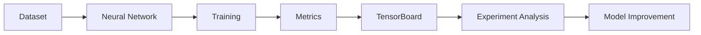

---

# 📊 Data Visualization

Visualization is integrated throughout the Data Science and Machine Learning workflow.

### Tools

* Matplotlib
* Seaborn
* Plotly
* Pandas Visualization

### Visualization Techniques

* Histograms
* Box Plots
* Scatter Plots
* Line Plots
* Bar Charts
* Heatmaps
* Correlation Matrices
* Distribution Plots
* Interactive Visualizations
* Geographical Visualizations

---

# 🔥 Visualization → Machine Learning

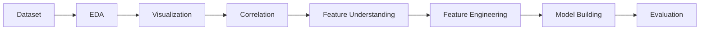

---

# 🚀 Hands-On Projects

This repository contains practical notebooks and projects built around datasets and real Machine Learning workflows.

---

## 🌦️ Australia Weather Prediction

A classification project focused on predicting rainfall/weather outcomes.

### Workflow

```text
Weather Dataset
      ↓
Data Cleaning
      ↓
Feature Engineering
      ↓
Season Extraction
      ↓
Train/Test Split
      ↓
Model Training
      ↓
Model Evaluation
```

### Concepts

* Classification
* Feature Engineering
* Seasonal Features
* Random Forest
* Logistic Regression
* Model Evaluation

---

# 🚕 Taxi Tip Prediction

A regression-tree based Machine Learning workflow.

### Concepts

* Regression
* Feature Preparation
* Decision Tree Regression
* Prediction
* Model Evaluation

---

# 💳 Credit Card Fraud Detection

A classification workflow focused on identifying fraudulent transactions.

### Concepts

* Classification
* Decision Trees
* Support Vector Machines
* Feature Preparation
* Model Evaluation

---

# 👥 Customer Segmentation

An unsupervised learning workflow using clustering.

### Techniques

* K-Means
* Feature Scaling
* Cluster Analysis
* Visualization
* Customer Segmentation

---

# 📞 911 Calls Analysis

A Data Analysis and Visualization project based on emergency call data.

### Focus

* Data Cleaning
* Exploratory Analysis
* Time-Based Analysis
* Visualization
* Pattern Discovery

---

# 💰 Finance Data Analysis

Finance-oriented exploratory and analytical notebooks involving:

* Data Analysis
* Visualization
* Financial Datasets
* Exploratory Data Analysis
* Capstone-style workflows

---

# 🛰️ Complete ML Portfolio Map

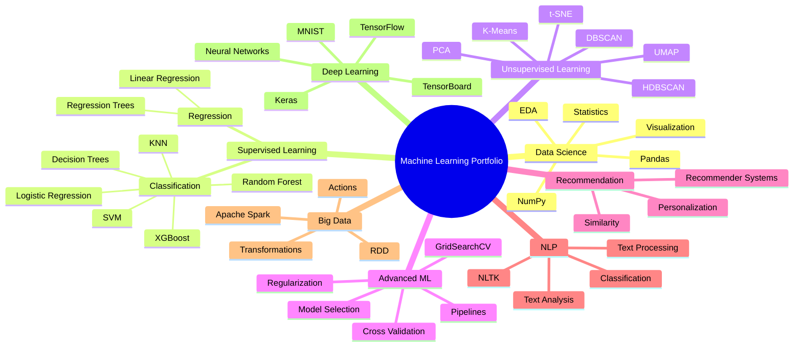

---

# 🧰 End-to-End ML Workflow

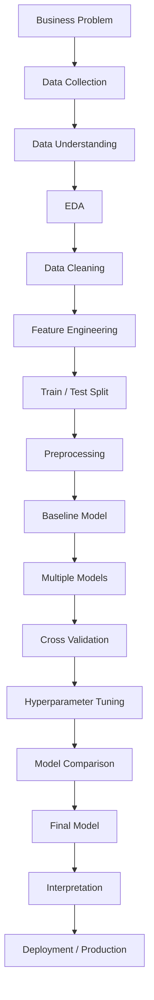

---

# 🧠 Model Selection Framework

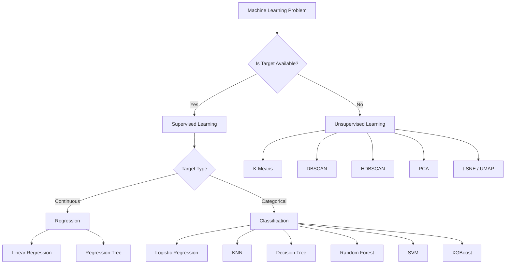

---

# 📚 Important Concepts Practiced

## 📊 Statistics

* Mean
* Median
* Variance
* Standard Deviation
* Correlation
* Distributions
* Outliers
* Feature Relationships

## 📊 Data Science

* Data Cleaning
* EDA
* Data Transformation
* Visualization
* Feature Engineering

## 🤖 Machine Learning

* Regression
* Classification
* Clustering
* Ensemble Learning
* Dimensionality Reduction
* Model Selection

## ⚙️ Model Engineering

* Train/Test Split
* Feature Scaling
* Cross Validation
* Pipelines
* GridSearchCV
* Hyperparameter Tuning
* Regularization

## 🧠 Deep Learning

* Neural Networks
* TensorFlow
* Keras
* Artificial Neural Networks
* MNIST
* TensorBoard

---

# 📊 Algorithms at a Glance

| Algorithm           | Learning Type | Main Use                    |
| ------------------- | ------------- | --------------------------- |
| Linear Regression   | Supervised    | Regression                  |
| Logistic Regression | Supervised    | Classification              |
| KNN                 | Supervised    | Classification              |
| Decision Tree       | Supervised    | Classification / Regression |
| Random Forest       | Ensemble      | Classification / Regression |
| SVM                 | Supervised    | Classification              |
| XGBoost             | Ensemble      | Classification / Regression |
| K-Means             | Unsupervised  | Clustering                  |
| DBSCAN              | Unsupervised  | Density Clustering          |
| HDBSCAN             | Unsupervised  | Density Clustering          |
| PCA                 | Unsupervised  | Dimensionality Reduction    |
| t-SNE               | Unsupervised  | Visualization               |
| UMAP                | Unsupervised  | Visualization               |
| Neural Networks     | Deep Learning | Regression / Classification |

---

# 🏆 Skills Demonstrated

## 🐍 Programming

* Python
* Functions
* Object-Oriented Programming Concepts
* Data Structures
* File Handling

## 📊 Data Science

* NumPy
* Pandas
* Exploratory Data Analysis
* Statistical Analysis
* Data Visualization

## 🤖 Machine Learning

* Scikit-learn
* Regression
* Classification
* Clustering
* Ensemble Learning
* Dimensionality Reduction
* Model Evaluation
* Hyperparameter Optimization

## 🧠 Advanced Machine Learning

* ML Pipelines
* GridSearchCV
* Cross Validation
* PCA
* Regularization
* Recommendation Systems
* NLP

## 🤖 Deep Learning

* TensorFlow
* Keras
* Artificial Neural Networks
* MNIST
* TensorBoard

## ⚡ Big Data

* Apache Spark
* RDDs
* Transformations
* Actions
* Distributed Processing Concepts

---

# 📂 Repository Structure

```text
machine_learning_with_python/
│
├── 0.1_Simple-Linear-Regression.ipynb
├── 02.Mulitple-Linear-Regression.ipynb
├── 03.Logistic_Regression.ipynb
├── 04.Multi-class_Classification.ipynb
├── 05.Decision_trees.ipynb
├── 06.Regression_Trees_Taxi_Tip.ipynb
├── 07.decision_tree_svm_ccFraud.ipynb
├── 08.KNN_Classification.ipynb
├── 09.Random_Forests_XGBoost.ipynb
├── 10.K-Means-Customer-Seg.ipynb
├── 11.Comparing_DBScan_HDBScan.ipynb
├── 12.PCA.ipynb
├── 13.tSNE_UMAP.ipynb
├── 14.Evaluating_Classification_Models.ipynb
├── 15.Evaluating_random_forest.ipynb
├── 16.Evaluating_k-means_clustering.ipynb
├── 17.Regularization_in_LinearRegression.ipynb
├── 18.ML_Pipelines_and_GridSearchCV.ipynb
├── 19.Practice_Project.ipynb
├── 20.FinalProject_AUSWeather.ipynb
│
└── machile_learning_basic_to_advance/
    │
    └── Refactored_Py_DS_ML_Bootcamp-master/
        │
        ├── 11-Linear-Regression/
        ├── 13-Logistic-Regression/
        ├── 14-K-Nearest-Neighbors/
        ├── 15-Decision-Trees-and-Random-Forests/
        ├── 16-Support-Vector-Machines/
        ├── 17-K-Means-Clustering/
        ├── 18-Principal-Component-Analysis/
        ├── 19-Recommender-Systems/
        ├── 20-Natural-Language-Processing/
        ├── 21-Big-Data-and-Spark/
        ├── 22-Deep Learning/
        │   └── TensorFlow_FILES/
        │       └── ANNs/
        │
        └── 23-EXTRA-NOTES-SciPy/
```

---

# 📈 Learning Progression

```text
Python
   ↓
NumPy
   ↓
Pandas
   ↓
Data Visualization
   ↓
Statistics
   ↓
Data Preprocessing
   ↓
Machine Learning Fundamentals
   ↓
Regression
   ↓
Classification
   ↓
Decision Trees
   ↓
Random Forest
   ↓
SVM
   ↓
XGBoost
   ↓
Clustering
   ↓
PCA
   ↓
t-SNE / UMAP
   ↓
Model Evaluation
   ↓
Cross Validation
   ↓
GridSearchCV
   ↓
ML Pipelines
   ↓
Regularization
   ↓
Recommendation Systems
   ↓
NLP
   ↓
Apache Spark
   ↓
Deep Learning
   ↓
TensorFlow
   ↓
Keras
   ↓
Artificial Neural Networks
   ↓
TensorBoard
```

---

# 🔬 From Algorithms to Problem Solving

The goal of this repository is to move beyond:

> **"I know Machine Learning algorithms."**

towards:

> **"I can understand a data problem, prepare the data, select appropriate algorithms, train multiple models, evaluate them, optimize them and build an end-to-end Machine Learning workflow."**

---

# 💡 Learning Philosophy

```text
Learn
  ↓
Understand
  ↓
Implement
  ↓
Experiment
  ↓
Evaluate
  ↓
Compare
  ↓
Optimize
  ↓
Build
  ↓
Apply to Real Problems
```

---

# 🌍 Real-World Applications

| Domain            | Example ML Application      |
| ----------------- | --------------------------- |
| 💰 Finance        | Fraud Detection             |
| 🛒 E-Commerce     | Recommendation Systems      |
| 🏥 Healthcare     | Prediction & Classification |
| 🌾 Agriculture    | Weather / Crop Prediction   |
| 📢 Marketing      | Customer Segmentation       |
| 💬 NLP            | Text Classification         |
| 🚕 Transportation | Demand Prediction           |
| 🏦 Banking        | Risk Classification         |
| 🎬 Entertainment  | Recommendation              |
| ⚡ Big Data        | Distributed Processing      |

---

# 🚀 Future Roadmap

The next stage of this repository is focused on moving from **learning and experimentation toward production-level AI/ML systems**.

### 🔮 Planned Topics

* Advanced Feature Engineering
* Advanced Ensemble Learning
* LightGBM
* Advanced XGBoost
* Time Series Forecasting
* Advanced NLP
* Transformers
* BERT
* Computer Vision
* CNNs
* RNNs
* LSTMs
* Model Deployment
* FastAPI
* Docker
* MLflow
* MLOps
* Cloud Machine Learning
* End-to-End Production ML Projects

---

# 🎯 Career Focus

This repository is being developed toward practical roles in:

* Data Science
* Machine Learning
* Applied Machine Learning
* Artificial Intelligence
* Data Analytics
* AI Engineering
* NLP
* Recommendation Systems
* Deep Learning

The focus is on developing the ability to work with **real datasets, Machine Learning workflows and practical problem-solving**, rather than only studying theoretical concepts.

---

# 👩‍💻 About Me

Hi! I'm **Divya Upadhyay**, a Computer Science student specializing in Artificial Intelligence.

I'm building my technical foundation around:

```text
Data Science
Machine Learning
Artificial Intelligence
Deep Learning
Natural Language Processing
Data Analytics
```

I enjoy working with data, experimenting with Machine Learning models and understanding how AI systems can solve practical problems.

---

# 💻 Current Technical Focus

```text
                         DATA & AI
                            │
          ┌─────────────────┼─────────────────┐
          │                 │                 │
          ▼                 ▼                 ▼
    Data Science      Machine Learning   Deep Learning
          │                 │                 │
       Pandas           Scikit-Learn     TensorFlow
       NumPy            Regression       Keras
       EDA              Classification   ANN
       Visualization    Clustering       TensorBoard
                         PCA
                         NLP
                         Recommendation
                         Spark
```

---

# 🧠 What I Want to Build

```text
Real-World Problem
       ↓
Understand Business Context
       ↓
Collect / Understand Data
       ↓
Clean Data
       ↓
EDA
       ↓
Feature Engineering
       ↓
Build Baseline
       ↓
Train Multiple Models
       ↓
Evaluate
       ↓
Optimize
       ↓
Select Best Model
       ↓
Deploy
       ↓
Monitor
       ↓
Improve
```

---

# ⭐ Repository Highlights

<p align="center">

| Area                   | Status |
| ---------------------- | :----: |
| Python                 |    ✅   |
| NumPy                  |    ✅   |
| Pandas                 |    ✅   |
| Data Visualization     |    ✅   |
| Regression             |    ✅   |
| Classification         |    ✅   |
| Decision Trees         |    ✅   |
| Random Forest          |    ✅   |
| SVM                    |    ✅   |
| KNN                    |    ✅   |
| XGBoost                |    ✅   |
| K-Means                |    ✅   |
| DBSCAN                 |    ✅   |
| HDBSCAN                |    ✅   |
| PCA                    |    ✅   |
| t-SNE / UMAP           |    ✅   |
| Model Evaluation       |    ✅   |
| Cross Validation       |    ✅   |
| GridSearchCV           |    ✅   |
| ML Pipelines           |    ✅   |
| Regularization         |    ✅   |
| Recommendation Systems |    ✅   |
| NLP                    |    ✅   |
| Apache Spark           |    ✅   |
| TensorFlow             |    ✅   |
| Keras                  |    ✅   |
| Neural Networks        |    ✅   |
| TensorBoard            |    ✅   |

</p>

---

# 🏅 The Bigger Picture

This repository represents my progression across the major layers of the Machine Learning ecosystem.

```text
                         MACHINE LEARNING
                                │
             ┌──────────────────┼──────────────────┐
             │                  │                  │
             ▼                  ▼                  ▼
       DATA SCIENCE       CLASSICAL ML       DEEP LEARNING
             │                  │                  │
             │                  │                  ├── TensorFlow
             │                  │                  ├── Keras
             │                  │                  ├── ANN
             │                  │                  └── TensorBoard
             │                  │
             │                  ├── Regression
             │                  ├── Classification
             │                  ├── Decision Trees
             │                  ├── Random Forest
             │                  ├── SVM
             │                  └── XGBoost
             │
             ├── NumPy
             ├── Pandas
             ├── EDA
             ├── Statistics
             └── Visualization

                         ADVANCED ML
                              │
             ┌────────────────┼────────────────┐
             │                │                │
             ▼                ▼                ▼
            NLP        Recommendation       Spark
             │                │                │
            NLTK        Personalization    Big Data
             │                │                │
             └────────────────┼────────────────┘
                              │
                         AI SYSTEMS
```

---

# 🧭 My Machine Learning Journey

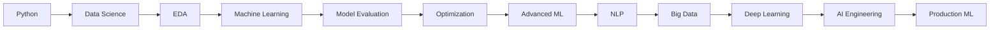

---

# 📌 Final Perspective

This repository is not intended to be just a collection of notebooks.

It represents a continuous learning process:

> **Understand the concept → Implement it → Work with data → Evaluate the model → Improve it → Apply it to a practical problem.**

The long-term goal is to transform this foundation into **production-ready Machine Learning and AI projects**.

---

# 🚀 Journey Continues

```text
                LEARNING
                   ↓
             EXPERIMENTING
                   ↓
                BUILDING
                   ↓
             PROBLEM SOLVING
                   ↓
            MACHINE LEARNING
                   ↓
          ARTIFICIAL INTELLIGENCE
                   ↓
             AI ENGINEERING
                   ↓
           PRODUCTION SYSTEMS
                   ↓
          CONTINUOUS LEARNING
```

---

<p align="center">

## 🤖 Learning Machine Learning. Building with Data. Growing into AI.

</p>

<p align="center">


</p>

---

<p align="center">

<b>⭐ If you find this repository useful, consider giving it a star!</b>

</p>

<p align="center">

<b>Made with Python 🐍 | Machine Learning 🤖 | Deep Learning 🧠 | Curiosity 🚀</b>

</p>
```
