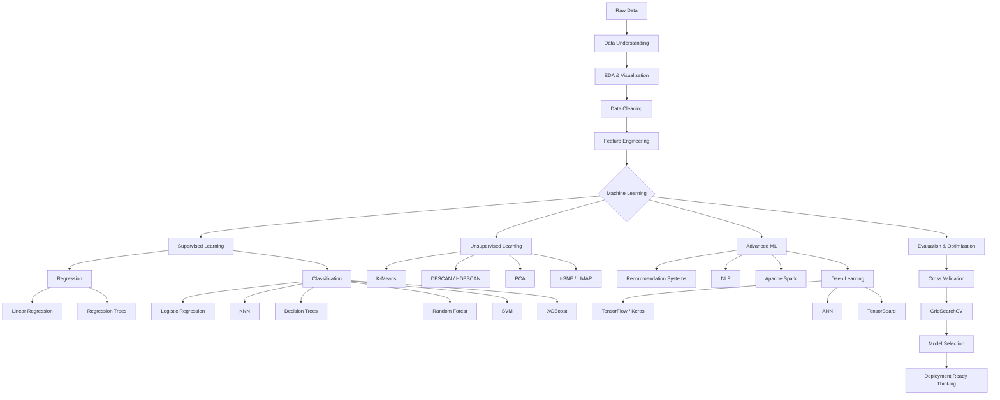
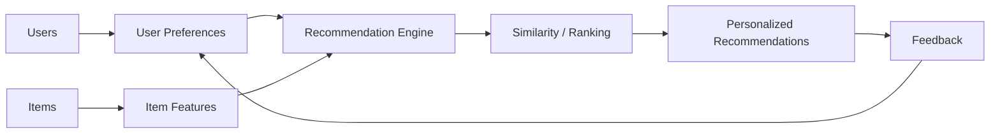
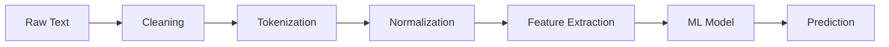
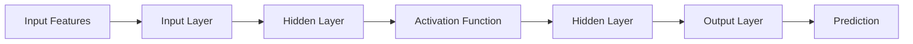

Bilkul Divya ❤️ **ab proper final version** de rahi hoon — **ONE single Markdown code block**, clean syntax, ML + DL + NLP + Recommendation Systems + Spark logos, aur **repository ke actual 160 saved visual outputs** included hain.

**Important:** `README.md` ke saath tumhare repo me `assets/graphs/` folder bhi hona chahiye, warna GitHub par images broken dikhenge.

````markdown
# 🤖 Machine Learning with Python — From Fundamentals to Deep Learning

<p align="center">


</p>

<p align="center">


</p>

<p align="center">


</p>

<p align="center">


</p>

<p align="center">
<b>A structured, hands-on Machine Learning portfolio covering classical ML, advanced ML, NLP, recommendation systems, Big Data and Deep Learning.</b>
</p>

<p align="center">
<i>From data preprocessing and EDA to model training, evaluation, optimization, neural networks and practical problem solving.</i>
</p>

---

## 📌 About This Repository

This repository documents my practical journey through the Machine Learning ecosystem.

It combines Python practice, data analysis, visualization, supervised and unsupervised learning, model evaluation, optimization, NLP, recommendation systems, Apache Spark and Deep Learning.

> **Core workflow:** Problem → Data → EDA → Cleaning → Feature Engineering → Model → Evaluation → Optimization → Interpretation → Application

---

## 🧠 Machine Learning Roadmap



---

## 📚 Table of Contents

- [Technology Stack](#-technology-stack)
- [Machine Learning Coverage](#-machine-learning-coverage)
- [Data Science & Visualization](#-data-science--visualization)
- [Supervised Learning](#-supervised-learning)
- [Unsupervised Learning](#-unsupervised-learning)
- [Model Evaluation & Optimization](#-model-evaluation--optimization)
- [Recommendation Systems](#-recommendation-systems)
- [Natural Language Processing](#-natural-language-processing)
- [Big Data & Apache Spark](#-big-data--apache-spark)
- [Deep Learning](#-deep-learning)
- [Complete Visualization Gallery](#-complete-visualization-gallery)
- [Hands-On Projects](#-hands-on-projects)
- [Repository Structure](#-repository-structure)
- [Skills Demonstrated](#-skills-demonstrated)
- [Learning Progression](#-learning-progression)
- [Learning Philosophy](#-learning-philosophy)
- [Future Roadmap](#-future-roadmap)
- [About Me](#-about-me)
- [Career Focus](#-career-focus)
- [Journey Continues](#-journey-continues)

---

# 🛠️ Technology Stack

| Domain | Tools / Technologies |
|---|---|
| Programming | Python |
| Data Science | NumPy, Pandas, SciPy |
| Visualization | Matplotlib, Seaborn, Plotly, Cufflinks |
| Machine Learning | Scikit-learn, XGBoost |
| Regression | Linear Regression, Multiple Regression, Regression Trees, Regularization |
| Classification | Logistic Regression, KNN, Decision Trees, Random Forest, SVM |
| Unsupervised ML | K-Means, DBSCAN, HDBSCAN, PCA, t-SNE, UMAP |
| Optimization | Cross Validation, StratifiedKFold, GridSearchCV, Pipelines |
| NLP | NLTK, Tokenization, Text Processing, Classification |
| Recommendation | Similarity, User/Item Recommendation Workflows |
| Big Data | Apache Spark, RDDs, Transformations, Actions |
| Deep Learning | TensorFlow, Keras, ANN, MNIST, TensorBoard |
| Development | Jupyter Notebook, Git, GitHub, VS Code |

---

# 📊 Machine Learning Coverage

| Area | Algorithms / Concepts | Practical |
|---|---|:---:|
| Regression | Linear, Multiple Linear, Regression Trees, Regularization | ✅ |
| Classification | Logistic Regression, Multi-class, KNN, Decision Trees, SVM | ✅ |
| Ensemble Learning | Random Forest, XGBoost | ✅ |
| Clustering | K-Means, DBSCAN, HDBSCAN | ✅ |
| Dimensionality Reduction | PCA, t-SNE, UMAP | ✅ |
| Evaluation | Accuracy, Precision, Recall, F1, Confusion Matrix, MAE, MSE, RMSE, R² | ✅ |
| Validation | K-Fold, StratifiedKFold, Cross Validation | ✅ |
| Optimization | GridSearchCV, Hyperparameter Tuning | ✅ |
| Pipelines | Scaling, PCA, Estimator Pipelines | ✅ |
| NLP | NLTK, Text Processing, Classification | ✅ |
| Recommendation | Similarity and recommendation workflows | ✅ |
| Big Data | Apache Spark, RDDs, Distributed Processing | ✅ |
| Deep Learning | TensorFlow, Keras, ANN, MNIST, TensorBoard | ✅ |

---

# 📊 Data Science & Visualization

Hands-on visualization work includes:

- Histograms
- Box Plots
- Scatter Plots
- Line Charts
- Bar Charts
- Heatmaps
- Correlation Matrices
- Regression Plots
- Distribution Plots
- Categorical Plots
- Matrix Plots
- Interactive Visualizations
- Geographical Visualizations
- Model evaluation visualizations
- Clustering visualizations
- Neural-network training visualizations

---

# 🎯 Supervised Learning

## 📈 Regression

Practical work with:

- Simple Linear Regression
- Multiple Linear Regression
- Regression Trees
- Residual Analysis
- MAE
- MSE
- RMSE
- R² Score
- Regularization

### Regression Workflow

```text
Dataset
   ↓
Data Cleaning
   ↓
Exploratory Data Analysis
   ↓
Feature Selection
   ↓
Train / Test Split
   ↓
Model Training
   ↓
Prediction
   ↓
Evaluation
   ↓
Optimization
```

---

## 🏷️ Classification

Algorithms and concepts covered:

- Logistic Regression
- Multi-class Classification
- K-Nearest Neighbors
- Decision Trees
- Random Forest
- Support Vector Machines
- XGBoost
- Confusion Matrix
- Classification Report
- Precision
- Recall
- F1 Score
- Accuracy

---

# 🔍 Unsupervised Learning

Covered concepts:

- K-Means Clustering
- DBSCAN
- HDBSCAN
- PCA
- t-SNE
- UMAP
- Cluster Evaluation
- Customer Segmentation
- Dimensionality Reduction
- Visualization of clusters

---

# 🧪 Model Evaluation & Optimization

A model is treated as a complete workflow rather than only something that trains successfully.

### Evaluation Metrics

- Accuracy
- Precision
- Recall
- F1 Score
- Confusion Matrix
- Classification Report
- MAE
- MSE
- RMSE
- R²

### Validation

- K-Fold Cross Validation
- StratifiedKFold
- Train/Test Split
- Model Comparison

### Optimization

- GridSearchCV
- Hyperparameter Tuning
- Regularization
- Feature Scaling
- PCA
- ML Pipelines
- Model Selection

---

## ⚙️ Pipeline + GridSearchCV

Example hyperparameter search:

```python
param_grid = {
    "knn__n_neighbors": [3, 5, 7],
    "pca__n_components": [2, 3]
}
```

---

# 🎯 Recommendation Systems

Hands-on exploration of recommendation workflows, similarity-based methods, user-item relationships and personalized recommendation concepts.

### Recommendation Workflow



### Concepts

- Recommendation Systems
- User-Item Relationships
- Similarity
- Ranking
- Personalized Recommendations
- Recommendation Workflows

---

# 📝 Natural Language Processing

Hands-on NLP exploration using Python and NLTK.

### NLP Concepts

- Text Cleaning
- Tokenization
- Stopword Handling
- Normalization
- Text Preprocessing
- Feature Preparation
- Text Classification
- Sentiment Analysis Concepts
- Spam Classification Concepts
- Document Classification Concepts

### NLP Pipeline



---

# ⚡ Big Data & Apache Spark

Explored concepts include:

- Apache Spark Fundamentals
- Spark with Python
- RDDs
- RDD Transformations
- RDD Actions
- Lambda Expressions
- Distributed Processing
- Big Data Processing Concepts

---

# 🤖 Deep Learning

The repository progresses from classical Machine Learning into neural-network based learning.

### Deep Learning Topics

- TensorFlow Fundamentals
- Keras Syntax
- Keras Workflows
- Artificial Neural Networks
- Neural Network Regression
- Neural Network Classification
- MNIST
- TensorFlow Estimators
- Model Training
- Model Evaluation
- TensorBoard

### Neural Network Workflow



---

# 🖼️ Complete Visualization Gallery

> **Important:** The gallery below uses the actual PNG outputs extracted from the notebooks in this repository.
>
> Keep the `assets/graphs/` folder inside your GitHub repository so all images render correctly.

---

## 📈 ML Fundamentals & Regression

<details>
<summary><b>Show Regression Visualizations</b></summary>


</details>

---

## 🏷️ Classification, Trees, KNN & SVM

<details>
<summary><b>Show Classification Visualizations</b></summary>


</details>

---

## 🔍 Clustering & Dimensionality Reduction

<details>
<summary><b>Show Clustering & PCA / t-SNE / UMAP Visualizations</b></summary>


</details>

---

## 🧪 Model Evaluation, Random Forest & Pipelines

<details>
<summary><b>Show Evaluation & Optimization Visualizations</b></summary>


</details>

---

## 🚀 Projects & Final Work

<details>
<summary><b>Show Project Visualizations</b></summary>


</details>

---

# 📝 NLP — Natural Language Processing

<details>
<summary><b>Show NLP Visualizations</b></summary>


</details>

---

# 🎯 Recommendation Systems

<details>
<summary><b>Show Recommendation System Visualizations</b></summary>


</details>

---

# 🧠 Deep Learning — TensorFlow & Keras

<details>
<summary><b>Show Deep Learning Visualizations</b></summary>


</details>

---

# 🚀 Hands-On Projects

## 🌦️ Australia Weather / Rainfall Prediction

Classification workflow using weather data, feature engineering, seasonal features, model training and evaluation.

**Key concepts:**

- Data preprocessing
- Date feature engineering
- Season extraction
- Classification
- Random Forest
- Model evaluation

---

## 🚕 Taxi Tip / Regression Trees

Regression workflow using decision-tree based prediction and evaluation.

**Key concepts:**

- Regression Trees
- Feature preparation
- Prediction
- Regression metrics
- Model evaluation

---

## 💳 Credit Card Fraud Detection

Classification experiments involving Decision Trees and SVM concepts.

**Key concepts:**

- Classification
- Decision Trees
- SVM
- Fraud detection workflow
- Model evaluation

---

## 👥 Customer Segmentation

K-Means based clustering workflow for customer segmentation.

**Key concepts:**

- Unsupervised Learning
- K-Means
- Cluster analysis
- Customer segmentation
- Visualization

---

## 📞 911 Calls Analysis

Exploratory data analysis, time-based analysis and visualization on emergency-call data.

---

## 💰 Finance Data Analysis

Finance-oriented exploratory analysis and visualization.

---

## 🧪 Practice & Capstone Work

Additional notebooks combining preprocessing, modeling, evaluation and visualization.

---

# 📂 Repository Structure

```text
machine_learning_with_python/
│
├── 0.1_Simple-Linear-Regression.ipynb
├── 02.Mulitple-Linear-Regression.ipynb
├── 03.Logistic_Regression.ipynb
├── 04.Multi-class_Classification.ipynb
├── 05.Decision_trees.ipynb
├── 06.Regression_Trees_Taxi_Tip.ipynb
├── 07.decision_tree_svm_ccFraud.ipynb
├── 08.KNN_Classification.ipynb
├── 09.Random_ Forests _XGBoost (4).ipynb
├── 10.K-Means-Customer-Seg.ipynb
├── 11.Comparing_DBScan_HDBScan.ipynb
├── 12.PCA.ipynb
├── 13.tSNE_UMAP.ipynb
├── 14.Evaluating_Classification_Models.ipynb
├── 15.Evaluating_random_forest.ipynb
├── 16.Evaluating_k-means_clustering.ipynb
├── 17.Regularization_in_LinearRegression.ipynb
├── 18.ML_Pipelines_and_GridSearchCV.ipynb
├── 19.Practice_Project.ipynb
├── 20.FinalProject_AUSWeather.ipynb
│
├── assets/
│   └── graphs/
│       └── 160 notebook-generated visual outputs
│
└── machile_learning_basic to advance/
    └── Refactored_Py_DS_ML_Bootcamp-master/
        │
        ├── 11-Linear-Regression/
        ├── 13-Logistic-Regression/
        ├── 14-K-Nearest-Neighbors/
        ├── 15-Decision-Trees-and-Random-Forests/
        ├── 16-Support-Vector-Machines/
        ├── 17-K-Means-Clustering/
        ├── 18-Principal-Component-Analysis/
        ├── 19-Recommender-Systems/
        ├── 20-Natural-Language-Processing/
        ├── 21-Big-Data-and-Spark/
        └── 22-Deep Learning/
```

---

# 🏆 Skills Demonstrated

### 🐍 Python & Data

`Python` · `NumPy` · `Pandas` · `Data Cleaning` · `EDA` · `Statistics` · `Data Visualization`

### 🤖 Classical Machine Learning

`Regression` · `Classification` · `Decision Trees` · `Random Forest` · `SVM` · `KNN` · `XGBoost`

### 🔍 Unsupervised Machine Learning

`K-Means` · `DBSCAN` · `HDBSCAN` · `PCA` · `t-SNE` · `UMAP`

### 🧪 Model Engineering

`Feature Scaling` · `Cross Validation` · `StratifiedKFold` · `Pipelines` · `GridSearchCV` · `Regularization` · `Model Selection`

### 📝 Advanced ML

`Recommendation Systems` · `NLP` · `Apache Spark`

### 🧠 Deep Learning

`TensorFlow` · `Keras` · `ANN` · `MNIST` · `TensorBoard`

---

# 📈 Learning Progression

```text
Python
   ↓
NumPy
   ↓
Pandas
   ↓
Data Visualization
   ↓
Statistics
   ↓
Data Preprocessing
   ↓
Machine Learning Fundamentals
   ↓
Regression
   ↓
Classification
   ↓
Decision Trees
   ↓
Random Forest
   ↓
SVM
   ↓
KNN
   ↓
XGBoost
   ↓
K-Means
   ↓
DBSCAN / HDBSCAN
   ↓
PCA
   ↓
t-SNE / UMAP
   ↓
Model Evaluation
   ↓
Cross Validation
   ↓
GridSearchCV
   ↓
ML Pipelines
   ↓
Regularization
   ↓
Recommendation Systems
   ↓
NLP
   ↓
Apache Spark
   ↓
Deep Learning
   ↓
TensorFlow
   ↓
Keras
   ↓
ANN
   ↓
TensorBoard
```

---

# 🔬 Learning Philosophy

> **Learn → Understand → Implement → Experiment → Evaluate → Compare → Optimize → Build → Apply**

The goal is to move beyond memorizing algorithms toward solving data problems end-to-end:

```text
Understand the Problem
        ↓
Collect / Load Data
        ↓
Clean the Data
        ↓
Explore the Data
        ↓
Visualize Patterns
        ↓
Engineer Features
        ↓
Train Models
        ↓
Evaluate Models
        ↓
Tune Hyperparameters
        ↓
Compare Models
        ↓
Interpret Results
        ↓
Build Practical Solutions
```

---

# 🚀 Future Roadmap

- Advanced Feature Engineering
- Advanced Ensemble Learning
- Time Series Forecasting
- Transformers
- BERT
- Computer Vision
- CNNs
- RNNs
- LSTMs
- FastAPI
- Docker
- MLflow
- MLOps
- Cloud ML
- Model Deployment
- Production-grade ML Systems

---

# 👩‍💻 About Me

Hi! I’m **Divya Upadhyay**, a Computer Science student specializing in Artificial Intelligence.

I am building my foundation across:

- Data Science
- Machine Learning
- Deep Learning
- Natural Language Processing
- Data Analytics
- Artificial Intelligence
- Practical AI Systems

I enjoy turning datasets into experiments, models and practical problem-solving workflows, with a strong focus on continuous learning and building real projects.

---

# 🎯 Career Focus

This portfolio is aligned with practical roles in:

- Data Science
- Machine Learning
- AI Engineering
- Data Analytics
- Applied AI
- Machine Learning Engineering

My goal is to continuously strengthen my technical skills through **real-world projects, problem solving, experimentation and production-oriented thinking**.

---

# 🚀 Journey Continues

```text
LEARNING
   ↓
EXPERIMENTING
   ↓
BUILDING
   ↓
PROBLEM SOLVING
   ↓
MACHINE LEARNING
   ↓
ARTIFICIAL INTELLIGENCE
   ↓
REAL-WORLD PROJECTS
   ↓
PRODUCTION SYSTEMS
```

---

<p align="center">
<b>🤖 Learning Machine Learning. Building with Data. Growing into AI.</b>
</p>

<p align="center">
⭐ If you find this repository useful, consider giving it a star!
</p>

<p align="center">
<i>The journey from learning algorithms to building intelligent systems continues...</i>
</p>
````
